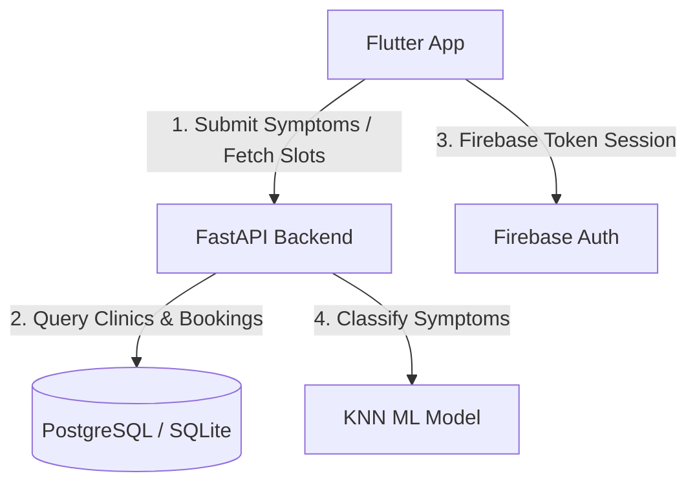

# 🩺 DigiDoc — AI-Powered Healthcare & Appointment Platform

DigiDoc is a production-grade, end-to-end healthcare system built to simplify disease analysis and doctor matchmaking. Powered by a **K-Nearest Neighbors (KNN) Machine Learning Classifier** on the backend and a premium **Flutter UI** on the frontend, DigiDoc lets patients diagnose potential conditions, find nearby matching specialists, and instantly book consultations.

---

## 🏗️ System Architecture



---

## ✨ Features

### 1. Persistent Sessions & Auto-Login 🔑
- **Seamless Restarts**: Integrates local storage caching (`shared_preferences`) to serialize and restore user profiles (`uid`, `role`, `name`, `email`, `specialty`) on startup. Bypasses login screens automatically during hot restarts and app launches.
- **Role-Based Routing**: Dynamically directs cached sessions to the **Patient Home Panel** or the **Doctor Home Panel**.

### 2. Smart Symptoms Picker (Phase 2) 🤒
- **Dynamic Search**: Instant local real-time autocomplete filtering across **133 categorized symptoms** with zero network delay.
- **Fluid Layout**: Selected symptoms are displayed as interactive, dismissible chips at the top of the interface.

### 3. ML Disease Diagnosis (Phase 3 & 4) 🧬
- **Multi-Disease Classifications**: Runs `model.predict_proba()` to compute and return a ranked list of possible matching diagnoses.
- **Rich Medical Analytics**: Cards render green visual progress bars indicating confidence percentages, descriptions, bulleted lists of precautions, and recommended specialties.

### 4. Geolocation & Clinic Mapping (Phase 5) 📍
- **Proximity Sorting**: Uses the **Haversine Formula** to query, calculate, and sort matching specialty clinics based on GPS coordinates.
- **In-App Controls**: Triggers phone calls via native dialers, matches coordinates on Google Maps via maps launcher, and displays clinic distances.

### 5. Collision-Free Slot Scheduler (Phase 6) 📅
- **Dynamic Hour Checking**: Select a preferred calendar date to query the SQL database. Booked hours are filtered out, displaying only available slots to the patient.
- **Concurrency Protection**: Double-booking validator protects slots from concurrent request collisions.

### 6. Timeline Appointment Log (Phase 7) 🔄
- **Unified Log**: Patients review booking history and cancel pending slots.
- **Doctor Controls**: Doctors accept patient requests (confirming the slot) or decline/cancel consultations.

---

## 🛠️ Technology Stack

| Component | Technology | Description |
| :--- | :--- | :--- |
| **Frontend** | Flutter (Dart) | Responsive mobile & web UI (Cupertino/Material) |
| **Local Cache** | SharedPreferences | Persisted offline login sessions |
| **Backend** | FastAPI (Python 3.10+) | Secure RESTful API routing |
| **ORM Database** | SQLAlchemy & PostgreSQL | Relational schema mapping (SQLite fallback) |
| **ML Engine** | Scikit-Learn | KNN Machine Learning Classifier |
| **Auth Gateway** | Firebase Auth | Email/Password credentials auth |

---

## 🚀 Installation & Local Run

### 1. Prerequisites
- **Flutter SDK**: [Install Flutter](https://docs.flutter.dev/get-started/install)
- **Python**: Version 3.10 or higher
- **Android SDK / Emulator** (or connected USB debugging phone)

### 2. Starting the Backend Server
```bash
cd backend
# Create virtual environment and activate
python3 -m venv venv
source venv/bin/activate

# Install dependencies
pip install -r requirements.txt

# Run the FastAPI server
uvicorn main:app --reload
```
*Verify the console outputs: `Uvicorn running on http://127.0.0.1:8000`*

### 3. Running the Flutter App (With USB Debugging Phone)
If you are testing the app on a physical Android phone connected via USB:

1. **Establish USB Port Forwarding**:
   ```bash
   adb reverse tcp:8000 tcp:8000
   ```
2. **Launch the Application**:
   ```bash
   flutter run
   ```

---

## 📜 Deployment

Complete deployment guides for hosting your FastAPI server on platforms like **Railway** or **Render** and compilation parameters for generating production APKs are documented in the [Deployment Guide](file:///Users/maniksangra/Downloads/DigiDoc-main/backend/deployment_guide.md).